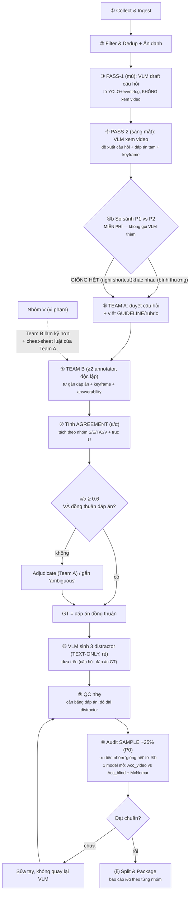

# EG-TrafficQA-VN — Tổng quan & Thiết kế Pipeline (v2, bản rút gọn chi phí)

> Tài liệu này dành để trình bày nội bộ nhóm và cho người mới (Team A partner, giảng viên hướng dẫn tham khảo nhanh). Đi kèm: `annotator_guideline_TeamB.md` (hướng dẫn thao tác cho annotator) và các file `pipeline_v2_option*.html` (sơ đồ mermaid render đầy đủ).

---

## 0. Mục tiêu & bối cảnh (3 câu)

EG-TrafficQA-VN là benchmark VideoQA cho tai nạn giao thông Việt Nam, khác các benchmark cũ ở hai điểm: **mỗi câu trả lời phải neo vào 1–3 keyframe bằng chứng**, và **có nhãn answerability** (video có đủ căn cứ để trả lời hay không). Đóng góp cốt lõi là quy trình xây dựng + kiểm chứng chứng minh benchmark thực sự **video-dependent** (không đoán được bằng ngôn ngữ), thông qua audit có/không video.

Phiên bản pipeline này là **bản đã hiệu chỉnh để vừa 2 tháng** với team 2 người (Team A) + annotator (Team B): giữ lại phần rẻ/hiệu quả (Pass-1/Pass-2), bỏ phần đắt (agent-crew 3 vai trò), audit modality-collapse chỉ trên mẫu thay vì toàn bộ.

---

## 1. Vai trò trong nhóm

| Vai trò | Ai | Việc chính | KHÔNG làm |
|---|---|---|---|
| **Team A** | 2 người, nhóm nghiên cứu chính | Duyệt/chỉnh câu hỏi từ draft VLM · viết **guideline/rubric** xác định đáp án đúng cho từng câu · xử lý adjudicate khi Team B bất đồng · chọn mẫu audit Gate B | Không tự chốt đáp án cuối cùng cho từng video (đó là việc của Team B) |
| **Team B** | Annotator (≥2 người độc lập / item) | Xem video, áp dụng guideline của Team A, **tự quyết** đáp án + chọn keyframe evidence + gắn nhãn answerability | Không được biết đáp án dự kiến của Team A hay của annotator khác trước khi tự nộp xong |

Nguyên tắc phân vai: **Team A = người thiết kế luật chơi, Team B = người chơi tạo ra nhãn** — tách biệt để bất đồng giữa các annotator Team B trở thành tín hiệu thống kê khách quan (không phải do một người tự quyết rồi tự tin).

---

## 2. Sơ đồ pipeline (bản chốt)

---

## 3. Bảng 12 bước: Mục đích – Input – Output

| # | Bước | Mục đích | Input | Output |
|---|---|---|---|---|
| 1 | Collect & Ingest | Thu thập nguyên liệu thô | Video YouTube/nguồn khác | Video thô trong kho trung tâm |
| 2 | Filter & Dedup + Anonymize | Đảm bảo đúng phân phối VN, bỏ trùng, tuân thủ riêng tư | Video thô | Video đã lọc + **đã blur overlay của kênh**. ⚠️ **SỬA 2026-09-05: pipeline KHÔNG blur mặt hay biển số** — nó chỉ xoá overlay (logo, đồng hồ, tên camera). Kiểm bằng mắt trên `trimmed/` còn thấy biển số `37B-016.09` cháy chữ chưa bị che, vì 30 file hiện có được dựng trước khi vùng `middle_bottom` được thêm vào `config.json`. |
| 3 | PASS-1 (mù) | Tạo nháp câu hỏi rẻ, làm điểm neo đo mức cần-video | YOLO detections + event-log ngắn (**không phải video**) | Nháp câu hỏi + đáp án tạm (P1), 5 nhóm S/E/T/C/V |
| 4 | PASS-2 (sáng mắt) | Cho VLM xem video thật, sửa/hoàn thiện P1 | Video đã anonymize + nháp P1 | Câu hỏi hoàn chỉnh + đáp án tạm (P2) + keyframe candidate |
| 4b | So sánh P1 vs P2 | Phát hiện sớm & miễn phí câu có nguy cơ shortcut | Cặp (P1, P2) | Nhãn "đã đổi" (bình thường) hoặc "giống hệt" (ưu tiên audit) |
| 5 | Team A viết guideline | Chuẩn hoá tiêu chí xác định đáp án | Câu hỏi từ P2 | Câu hỏi đã duyệt + guideline/rubric (không kèm đáp án) |
| 6 | Team B gán nhãn độc lập | Tạo ground-truth từ ≥2 annotator độc lập | Video + câu hỏi + guideline | ≥2 bộ nhãn độc lập: đáp án + keyframe + answerability |
| 7 | Tính agreement | Định lượng mức đồng thuận | Các bộ nhãn Team B | Chỉ số κ/α (tách theo nhóm + trục U) |
| 8 | Gate quyết định GT | Chốt đáp án cuối, xử lý bất đồng | Chỉ số agreement + nhãn Team B | Đáp án GT đã chốt, hoặc chuyển adjudicate/"ambiguous" |
| 9 | VLM sinh distractor | Tạo phương án sai hợp lý | Cặp (câu hỏi, đáp án GT) — không cần video | 3 distractor cùng miền, độ dài tương đương |
| 10 | QC nhẹ | Kiểm tra hình thức trước audit sâu | Bộ QA hoàn chỉnh | QA đạt chuẩn, hoặc trả về sửa |
| 11 | Audit Gate B (mẫu) | Kiểm chứng định lượng mức phụ thuộc video | Mẫu QA (ưu tiên "giống hệt") + 1 model mở, 2 điều kiện | Acc_video, Acc_blind, VG, BG, McNemar |
| 12 | Split & Package | Bàn giao dataset cuối kèm bằng chứng | QA đã audit + chỉ số κ/α/VG/BG | Train/Val/Test + báo cáo theo từng nhóm |

---

## 4. Các khái niệm cốt lõi (giải thích ngắn gọn)

**Pass-1 / Pass-2 và delta.** Pass-1 là VLM đoán "mù" (chỉ có nhãn YOLO + event-log, không có pixel). Pass-2 là cùng VLM đó, giờ xem video thật, tự sửa lại Pass-1. Nếu P1 ≠ P2 → tốt, chứng tỏ cần video mới trả lời đúng. Nếu P1 = P2 → đáng ngờ (có thể đoán được không cần video) → ưu tiên đưa vào mẫu audit + Team A xem lại event-log có lộ quá nhiều thông tin không.

**Distractor.** Là các phương án SAI nhưng hợp lý, đặt cạnh đáp án đúng trong câu trắc nghiệm để kiểm tra model có thực sự hiểu video hay chỉ đoán theo cảm giác ngôn ngữ. Theo đúng thứ tự VRU-Accident: **người/Team B chốt đáp án đúng trước**, sau đó VLM **chỉ** sinh 3 distractor dựa trên cặp (câu hỏi, đáp án đúng).

> **SỬA 2026-09-05 — quy tắc "VLM không bao giờ tự chọn đáp án đúng" đã bị thay đổi có chủ ý.**
> Hệ thống trong `vlm/` **có** sinh đáp án nháp cho từng shot. Quyết định này được đưa ra khi
> đã biết rõ cái giá: (1) annotator nhìn thấy đáp án nháp sẽ bị *anchoring*, nên κ giữa hai
> annotator không còn là tín hiệu độc lập như mục 5 giả định; (2) Gate B ở bước 11 sẽ đo model
> trên nhãn mà chính model đã góp phần tạo ra, nên `VG = Acc_video − Acc_blind` không còn là
> bằng chứng chống-shortcut mạnh như `modality_collapse_evaluation.md` mô tả.
> Rào chắn duy nhất còn giữ: nhãn nháp nằm trong `vlm/data/output/`, **không bao giờ** được ghi
> vào bảng `reviews` hay `pipeline.db`. Ai muốn khôi phục sức mạnh của Gate B thì phải bỏ nhãn
> nháp khỏi màn hình annotator, không phải sửa công thức.

**Keyframe evidence.** 1–3 chỉ số frame làm bằng chứng cho đáp án — do Team B chọn thủ công khi xem video, không phải VLM tự đề xuất.

**Answerability (trục U).** Nhãn 3 lớp `answerable / ambiguous / not-answerable`, gắn lên MỌI câu hỏi (không phải nhóm câu hỏi thứ 6). Khi Team B bất đồng với nhau → tín hiệu "ambiguous" tự nhiên, không bịa.

**Gate quyết định GT (bước 8) vs Gate B audit (bước 11) — đừng nhầm.** Gate 8 đo *con người có đồng ý với nhau không* (chất lượng nhãn, dùng κ/α). Gate B (bước 11) đo *model có cần video không* (chất lượng chống-shortcut, dùng VG/BG/McNemar). Một câu κ cao ở Gate 8 vẫn có thể bị shortcut ở Gate B — hai gate độc lập nhau.

**Vì sao Gate B cần 2 lần chạy VLM / câu hỏi?** VG = Acc_video − Acc_blind và McNemar đều là hàm của **chênh lệch giữa 2 điều kiện** (có video / không video) — không có cách nào đo "video có giúp ích" mà chỉ cần 1 lần chạy. Đơn vị tính là **mỗi câu hỏi**, không phải mỗi video (1 video ra ~5-6 câu).

---

## 5. Metric thống kê đo độ đồng thuận Team B

| Metric | Khi nào dùng | Ưu tiên |
|---|---|---|
| **Cohen's Kappa (κ)** | Đúng 2 annotator cố định / item | P0 |
| **Fleiss' Kappa** | ≥3 annotator, gán cố định theo item | P0/P1 |
| **Krippendorff's Alpha (α)** | Số annotator/item không cố định, có dữ liệu thiếu | P1 — linh hoạt nhất |
| **Percent Agreement (thô)** | Chỉ báo cáo kèm, không dùng làm ngưỡng QC | P2 |
| **Gwet's AC1** | Khi phân phối đáp án lệch mạnh gây "kappa paradox" | P2/P3, tuỳ chọn |

**Quy tắc vàng:** báo cáo κ/α **tách theo từng nhóm câu hỏi** (S/E/T/C/V) và **tách riêng cho trục U** — không gộp chung một con số. Ngưỡng giữ nguyên κ/α ≥ 0.6.

---

## 6. Chi phí ước tính (tóm tắt)

| Mục | Giá trị |
|---|---|
| VLM calls tạo QA / video | 2 (Pass-1 + Pass-2, batch cả 5 nhóm trong 1 lần gọi mỗi pass) |
| VLM call sinh distractor / câu | +1, **text-only** (không video) — rẻ |
| VLM calls audit Gate B | 2 × (~25% số câu được lấy mẫu, ưu tiên nhóm "giống hệt") |
| Nhân lực | Team A: 2 người (thiết kế) · Team B: ≥2 annotator độc lập (gán nhãn) |
| Hạ tầng thêm | Không cần agent-crew, không cần RAG/vector DB — chỉ cần 1 model mở (Qwen2.5-VL/InternVL) cho audit |
| Metric Gate B dùng | Chỉ P0 (Accuracy + VG/BG + McNemar) — bỏ SignedVideoGain/S(q) vì cần logit, tốn công |

---

## 7. FAQ nội bộ

**Q: P1 và P2 khác nhau thì làm gì?**
Bình thường, không cần làm gì — dùng P2 làm bản chính thức. Chỉ khi P1 = P2 (giống hệt) mới cần hành động (xem mục 4).

**Q: Distractor tạo trước hay sau khi Team B chốt đáp án?**
SAU. Nếu tạo trước (dựa theo đáp án tạm P2 của VLM) mà Team B sau đó quyết định khác, distractor cũ có thể trùng/sai lệch với GT thật.

**Q: Nhóm V (vi phạm) xử lý khác gì?**
Team B vẫn là người quyết định, nhưng làm kỹ hơn (khuyến khích 2 người chắc chắn, không rút gọn) và có thêm 1 trang cheat-sheet luật giao thông cơ bản do Team A chuẩn bị sẵn — không dùng RAG/vector DB vì không đáng chi phí kỹ thuật ở quy mô này.

**Q: Khi nào Team A can thiệp vào bước gán nhãn của Team B?**
Chỉ khi Team B bất đồng với nhau ở bước 8 (Gate quyết định GT) — Team A đóng vai trò adjudicate hoặc quyết định gắn nhãn "ambiguous" nếu không có cách nào phân xử rõ ràng.

**Q: Vì sao không audit 100% số câu ở Gate B?**
VG/BG là thống kê ở mức dataset, không bắt buộc đo từng câu. Mẫu ngẫu nhiên/có ưu tiên ~25% đã đủ tin cậy để báo cáo, và tiết kiệm đáng kể chi phí so với audit toàn bộ.

---

## 8. Nguồn gốc thiết kế (map sang paper tham khảo)

| Quyết định thiết kế | Lấy cảm hứng từ |
|---|---|
| Pass-1 (mù) → Pass-2 (sáng mắt), delta = tín hiệu video-dependence | NextMotionQA (2026) |
| Người chốt đáp án đúng trước, VLM chỉ sinh distractor sau | VRU-Accident (ICCV 2025) |
| Dual-path độ khó (câu khó → người, câu dễ → AI) + cheat-sheet luật cho nhóm V | WaterVideoQA/NaviMind (2026) |
| Vai trò tách bạch trong pha tạo câu hỏi (draft → xác minh → tinh chỉnh) | SciVideoBench (2025) |
| VLM sinh 4 ứng viên, người chọn/duyệt | RoadSceneVQA/CH-MA (AAAI 2026) |
| VG/BG/McNemar là chuẩn tối thiểu (P0) đủ bảo vệ luận điểm video-dependent | Korkut et al., "From Accuracy to Visual Dependence" (modality_collapse_evaluation.md) |
