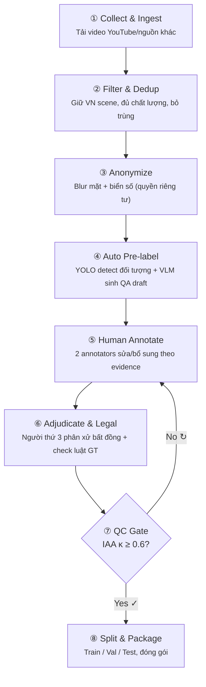
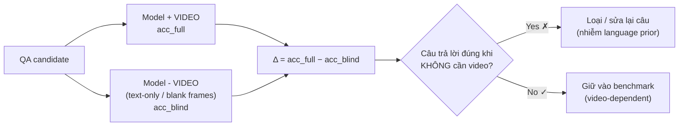
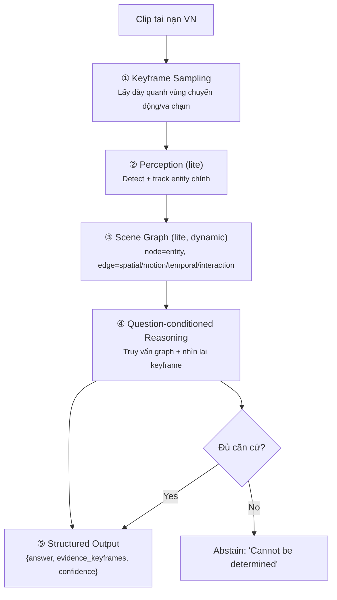
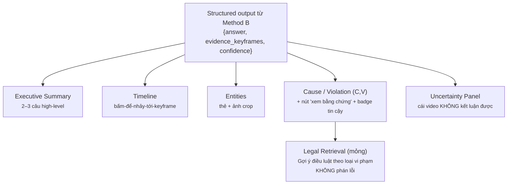

# EG-TrafficQA-VN: Evidence-Grounded, Video-Dependent Traffic Accident VideoQA cho Giao thông Hỗn hợp Việt Nam

> **Bản báo cáo sơ bộ (pre-paper draft)** — phác thảo toàn bộ nội dung sẽ đưa vào bài báo/khóa luận.
> Định hướng: **A = Benchmark-centric (đóng góp chính)**, **B = Methodology (đề xuất quy trình)**, **C = Application demo (hướng phát triển, không nghiên cứu)**.
> Mục tiêu ứng dụng: **hỗ trợ lực lượng công an phân tích tai nạn giao thông từ video.**

---

## Abstract

Chúng tôi đề xuất **EG-TrafficQA-VN**, một benchmark Video Question Answering (VideoQA) cho tai nạn giao thông trong bối cảnh giao thông hỗn hợp (mixed / motorcycle-heavy) tại Việt Nam, thu thập từ dashcam và CCTV. Khác với các benchmark tai nạn hiện có vốn dừng ở cặp *Question → Answer* và dễ bị **modality collapse** (model trả lời đúng nhờ language prior mà không thực sự "nhìn" video), benchmark của chúng tôi bổ sung hai thành phần: (1) **keyframe evidence** — mỗi câu trả lời phải neo vào 1–3 frame bằng chứng, và (2) **answerability** — nhãn cho biết video có đủ căn cứ để trả lời hay không. Đóng góp chính (A) là **một quy trình xây dựng + đánh giá chứng minh benchmark thực sự video-dependent**, thông qua *blind-test auditing* (đo chênh lệch độ chính xác khi có/không có video) như một cổng lọc bắt buộc. Trên nền benchmark đó, chúng tôi đề xuất (B) một quy trình method evidence-grounded có khả năng *abstain* (biết nói "không đủ căn cứ"), sử dụng scene graph lite làm bước reasoning trung gian; và phác thảo (C) một hệ thống demo hỗ trợ điều tra viên (timeline bấm-để-tua keyframe + panel uncertainty + lớp gợi ý điều luật) như hướng phát triển tương lai.

---

## 1. Problem Statement

### 1.1. Bối cảnh & động lực

Điều tra viên cần nhanh chóng nắm được diễn biến chính của một vụ tai nạn từ video (dashcam / CCTV): **chuyện gì xảy ra, ai liên quan, theo trình tự nào, nguyên nhân/vi phạm trực tiếp là gì — và bằng chứng ở đâu**. Một hệ thống Video Understanding / VQA có thể hỗ trợ (không thay thế) quá trình này bằng cách trích xuất thông tin có cấu trúc kèm bằng chứng.

### 1.2. Vì sao khó

- **Sự kiện nhanh & hiếm:** khoảnh khắc va chạm thường chỉ vài frame; dữ liệu tai nạn thưa thớt so với video giao thông thông thường.
- **Che khuất & tốc độ cao:** vật cản (xe đỗ) che tầm nhìn, chuyển động nhanh làm việc trích xuất quan hệ đối tượng khó.
- **Giao thông hỗn hợp Việt Nam:** mật độ xe máy cao, hành vi bất quy tắc, góc CCTV đa dạng — một **distribution shift** mà các benchmark ego-view ô tô phương Tây chưa cover.
- **Rủi ro "trả lời mà không nhìn":** với use case điều tra, một model đoán đúng nhờ thói quen ngôn ngữ nhưng không dựa trên video là **nguy hiểm** — cần chứng minh được hệ thống thật sự phụ thuộc vào bằng chứng thị giác.

### 1.3. Khoảng trống nghiên cứu (research gap)

Hai lỗ hổng của các benchmark tai nạn hiện tại:

1. **Chỉ có Question → Answer, không có evidence grounding.** Không thể kiểm chứng câu trả lời dựa trên phần nào của video.
2. **Modality collapse / language-prior exploitation.** Định dạng MCQ cố định tạo option bias; nhiều câu trả lời đúng được ngay cả khi không xem video.

EG-TrafficQA-VN lấp cả hai: **evidence-grounded** + **quy trình chứng minh video-dependence**.

---

## 2. Related Work

*(Các công trình dưới đây được dùng để định vị đóng góp; trích dẫn đầy đủ sẽ bổ sung ở bản chính thức.)*

**Traffic accident VideoQA benchmarks.**
- **SUTD-TrafficQA** — tiên phong traffic video QA (≈10K video, 62.5K cặp QA, 6 reasoning task).
- **MM-AU** — 58 loại tai nạn, góc ego dashcam; câu hỏi causal đồng nhất → dễ bị language-prior exploitation.
- **VRU-Accident** — tai nạn liên quan người đi bộ/xe đạp; **6 nhóm câu hỏi + dense captioning**; distractor sinh bằng GPT-4o theo đáp án đúng. *(Thiết kế gần nhất với ý tưởng ban đầu của chúng tôi → cần phân biệt rõ.)*
- **AUTOPILOT-VQA** — incident-centric dashcam VQA (>600 clip: va chạm / near-miss / no-incident); danh sách category (thời tiết–ánh sáng, môi trường, road layout, mặt đường, biển báo, đối tượng, xuất hiện tai nạn, vị trí va chạm, khả năng tránh) gần trùng thiết kế ban đầu của chúng tôi.
- **RoadSocial, TAU-106K, CrashSight, CCTVBench, DriveQA** — mở rộng scale/scope traffic scene understanding.

**Modality collapse trong Traffic VideoQA.**
- Dòng nghiên cứu *audit visual dependence* chỉ ra: nhiều benchmark không phân biệt được "hiểu video thật" và "khai thác correlation ngôn ngữ"; MCQ tạo option bias; MM-AU đặc biệt dễ bị language-prior. → Cơ sở cho **blind-test filter** của chúng tôi.

**Evidence-grounded / Grounded VideoQA.**
- **EG-VQA** — annotate evidence bằng temporal boundary + textual evidence; đề xuất metric **EG-F1**; phát hiện các Video-LLM (kể cả proprietary) chật vật khi ground câu trả lời một cách nhất quán.
- **Grounded VideoQA (GVQA)** — bắt buộc grounding objective, output G là segment/bbox/tập frame/scene graph chỉ ra phần video hỗ trợ câu trả lời (NExT-GQA, DeVE-QA…).
- **Open-o3-Video / V-STAR** — grounded video reasoning với evidence không-thời gian tường minh, vượt GPT-4o trên benchmark grounding.

**Định vị đóng góp của chúng tôi.** Không lặp lại VRU/AUTOPILOT (fixed MCQ + caption). Chúng tôi (i) chuyển sang **keyframe-evidence grounding**, (ii) thêm trục **answerability**, và (iii) biến **video-dependence auditing thành cổng kiểm định benchmark** — điều các benchmark tai nạn hiện tại chưa làm — trên **distribution giao thông hỗn hợp VN**.

---

## 3. Task Formulation (Input → Output)

### 3.1. Input

Một clip tai nạn giao thông từ dashcam/CCTV bối cảnh Việt Nam. Ưu tiên clip **có context** (tổng ~15–30s, có đoạn trước va chạm) để phần grounding có ý nghĩa.

### 3.2. Output (chi tiết)

Với mỗi clip, benchmark định nghĩa một tập câu hỏi thuộc các nhóm S/E/T/C/V. **Mỗi cặp QA có cấu trúc output như sau:**

```json
{
  "question_id": "clip017_C_01",
  "group": "C",                       // S | E | T | C | V
  "question": "What was the primary cause of this accident?",
  "options": ["A ...", "B ...", "C ...", "D ...",
              "Cannot be determined from the video"],
  "answer": "B",                      // đáp án đúng (có thể là 'Cannot be determined')
  "evidence_keyframes": [9, 12],      // 1–3 frame index làm bằng chứng
  "answerability": "answerable",      // answerable | ambiguous | not-answerable
  "iaa": { "annotators": 2, "agreement": true }
}
```

Ba lớp thông tin của output — điểm khác biệt cốt lõi so với benchmark cũ:

| Lớp | Nội dung | Ai tạo | Vai trò |
|---|---|---|---|
| **Answer** | Đáp án MCQ (kèm option "Cannot be determined") | Human GT | Nội dung |
| **Evidence** | 1–3 keyframe bằng chứng | Human GT | Verifiability / grounding |
| **Answerability** | `answerable / ambiguous / not-answerable` | Human GT (dùng cả bất đồng annotator) | Đo "biết mình không biết" |

> **Lưu ý quan trọng về U (answerability).** U **không** phải nhóm câu hỏi thứ 6 ngang hàng S/E/T/C/V. U là **thuộc tính cắt ngang** gắn lên *mọi* cặp QA, hoạt động qua 2 cơ chế: (1) thêm option hợp lệ *"Cannot be determined from the video"* vào MCQ, với một số câu có đáp án đúng chính là option này; (2) meta-tag answerability khi gán nhãn, trong đó **chỗ nào các annotator bất đồng → tín hiệu "ambiguous" tự nhiên**, không bịa con số.

### 3.3. Question Taxonomy

*(Xem HTML: `02_question_taxonomy.html`.)*

| Nhóm | Mục đích điều tra | Ví dụ câu hỏi | Thông tin thu được | Reasoning | Evidence (keyframe) | Có thể "cannot tell"? |
|---|---|---|---|---|---|---|
| **S — Scene/context** | Khách quan hoá bối cảnh | *"What are the weather and lighting conditions?"* | Thời tiết, ánh sáng, loại đường, mặt đường | Perception tĩnh | 1 (đại diện) | Hiếm |
| **E — Entities** | Xác định đối tượng liên quan | *"What color and type is the vehicle that caused the collision?"* | Phương tiện/người liên quan, đặc điểm | Recognition + grounding | 1 (+bbox lite) | Đôi khi (bị che) |
| **T — Temporal/sequence** | Dựng trình tự diễn biến | *"Did the pedestrian step onto the road before or after the gray car appeared?"* | Thứ tự các sub-event | Temporal ordering | **2** (before/after) | Có |
| **C — Causal** | Nguyên nhân trực tiếp | *"Which action right before the collision was the primary cause?"* | Nguyên nhân, chuỗi nhân-quả | Causal | 1–2 (quanh trigger) | Có |
| **V — Violation/risk** | Tình tiết pháp lý | *"Is there any observable traffic violation (wrong lane / no observation)?"* | Vi phạm / hành vi rủi ro | Rule-based perception | 1 (chứng minh) | Có |
| **U — Answerability** *(trục cắt ngang)* | Đo khả năng "biết mình không biết" | *(gắn lên mọi câu trên)* | answerable / ambiguous / not-answerable | Abstention / calibration | — | *là bản chất của U* |

> **Về overlap keyframe giữa C/T/V:** trùng nhau là **bình thường** (nguyên nhân, trình tự, vi phạm đều tụ quanh va chạm). Chỉ cần **cố ý đưa vào các câu có evidence NGOÀI cửa sổ va chạm** (hành vi trước đó 5–10s, hậu quả sau đó) để grounding không trở nên trivial.

---

## 4. Labeling Pipeline (Đóng góp A — phần 1)

*(Xem HTML: `01_labeling_pipeline.html`.)*

Quy trình 8 bước biến video thô YouTube thành bộ VQA chất lượng cao:



| Bước | Tên | Mô tả | Vai trò |
|---|---|---|---|
| 1 | Collect & Ingest | Tải video YouTube (và nguồn khác) về hệ thống trung tâm | Nguồn dữ liệu |
| 2 | Filter & Dedup | Giữ lại **VN scene**, chất lượng đủ tốt, loại trùng lặp | Đảm bảo distribution & chất lượng |
| 3 | Anonymize | **Blur khuôn mặt + biển số** người tham gia giao thông | Tuân thủ quyền riêng tư |
| 4 | Auto Pre-label | **YOLO** phát hiện xe/người + **VLM** sinh cặp QA *draft* tự động | High recall, giảm công người |
| 5 | Human Annotate | **2 annotators** kiểm tra/sửa/bổ sung, dựa trên **evidence** trong video | Quality control, tạo GT |
| 6 | Adjudicate & Legal | Bất đồng → **người thứ 3** phân xử; kiểm tra tính hợp lệ theo quy tắc giao thông | Xử lý mâu thuẫn + hợp lệ pháp lý |
| 7 | QC Gate | Đo **IAA (Inter-Annotator Agreement)**; chỉ đạt khi **κ ≥ 0.6** | Cổng chất lượng bắt buộc |
| 8 | Split & Package | Chia **Train / Val / Test**, đóng gói sẵn dùng | Bàn giao dataset |

**Phân biệt loại dữ liệu (bắt buộc rõ trong bài):**
`raw video` → `filtered/anonymized` → `VLM draft QA` → `human-verified` → `adjudicated GT` → (khi qua QC) → `final ground truth`.

---

## 5. QA Construction + Anti-Modality-Collapse Evaluation (Đóng góp A — phần 2, **cốt lõi**)

*(Xem HTML: `03_qa_construction_anti_collapse.html`.)*

Đây là **novelty chính**: không chỉ tạo QA, mà **chứng minh benchmark thực sự video-dependent**. Gồm 2 lớp.

### 5.1. Creation-side (khi tạo câu hỏi)

- Distractor **không đoán được từ language prior** (không để một đáp án "nghe hợp lý nhất" luôn đúng).
- Thêm option hợp lệ **"Cannot be determined from the video"**; chủ động tạo câu mà đáp án đúng chính là option này (test abstain).
- **Cân bằng phân phối đáp án** để không guess được theo tần suất.
- Thêm câu **counterfactual / adversarial** buộc phải nhìn video.

### 5.2. Auditing-side (blind-test filter — cổng kiểm định)



- Chạy model ở hai điều kiện: **có video** vs **không có video** (text-only hoặc frame trắng).
- Câu nào trả lời đúng **mà không cần nhìn video** → nhiễm language prior → **loại hoặc chỉnh lại**.
- **Evidence grounding cũng là cơ chế chống collapse**: bắt model chỉ ra keyframe ⇒ buộc phụ thuộc thị giác.

**Phát biểu Novelty 1 (một câu):** *một quy trình construction + evaluation chứng minh benchmark thực sự video-dependent, khác với VRU/MM-AU nơi model có thể đoán nhờ ngôn ngữ.*

---

## 6. Proposed Method (Ý B — đề xuất quy trình, chưa phải phương pháp chính)

*(Xem HTML: `04_method_B_pipeline.html`.)*

Trên nền benchmark A, chúng tôi **đề xuất** một quy trình method evidence-grounded có khả năng *abstain*. Đây là proposal (baseline định hướng), không phải claim là phương pháp tối ưu cuối cùng.



### 6.1. Scene graph trong method (làm rõ)

- **Là gì:** biểu diễn có cấu trúc của cảnh — **node = đối tượng** (xe, người, đèn, làn) + thuộc tính; **edge = quan hệ**. Với video là **dynamic scene graph** (thay đổi theo keyframe).
- **4 loại quan hệ cho tai nạn:** *spatial* (người — bên phải — làn), *motion* (xe xám — đang tiến tới — người), *temporal* ([bước xuống] — trước — [va chạm]), *interaction* (xe xám — va chạm với — người).
- **Lợi ích:** biến câu C/T thành **truy vấn edge causal/temporal** (bớt bịa); **interpretability** cho điều tra; **evidence link tự nhiên** (node quan sát ở keyframe nào → keyframe đó là bằng chứng).
- **Quy trình tạo (lite):** perception (detect+track) → relation extraction (prompt VLM xuất JSON ~4 loại quan hệ mỗi keyframe) → temporal linking (nối theo keyframe) → reason (truy vấn graph + nhìn lại keyframe).
- **Rủi ro & cách biến thành đóng góp:** graph tự sinh **chặn trần** kết quả (occlusion, crash nhanh). Xử lý bằng **ablation "có vs không scene graph"** — nếu giúp → finding tốt; nếu không giúp cho crash nhanh → **cũng là finding có giá trị**. Method-centric sống được ở cả hai kết quả.
- **Nguyên tắc:** scene graph là **bước trung gian của method B**, **KHÔNG** phải nhãn của benchmark A (annotator không vẽ graph).

### 6.2. Method B "thắng" baseline ở đâu (3 trục, không chỉ accuracy)

1. **Grounding accuracy:** B chỉ đúng keyframe bằng chứng; baseline không chỉ được frame.
2. **Video-dependence:** ở blind-test, accuracy của B **rớt mạnh khi bỏ video** (tốt — thật sự nhìn); baseline vẫn đúng nhờ language prior (xấu).
3. **Abstention:** B nói *"cannot tell"* đúng ở câu U; baseline bịa đáp án.

---

## 7. Application Demo (Ý C — hướng phát triển, không nghiên cứu)

*(Xem HTML: `05_system_C_demo.html`.)*

Sơ đồ hệ thống **draft** hỗ trợ điều tra viên, để **demo tương lai** (không có đóng góp nghiên cứu):



- **Timeline bấm-để-tua keyframe** (dễ hơn tua segment — chỉ jump 1 frame).
- **Uncertainty panel** — chống việc điều tra viên tin nhầm AI.
- **Legal layer chỉ retrieval**: gợi ý điều luật liên quan tới loại vi phạm V, **không adjudicate lỗi** (nhạy cảm, rủi ro cao — chủ ý loại khỏi phạm vi nghiên cứu).

---

## 8. Evaluation Metrics

| Mục tiêu đo | Metric | Ghi chú |
|---|---|---|
| Độ chính xác trả lời | **Accuracy theo từng nhóm** S/E/T/C/V | Không gộp chung để tránh che khuất điểm yếu nhóm khó |
| Chất lượng grounding | **Keyframe grounding accuracy có tolerance** (frame model chọn nằm trong ±k frame quanh keyframe GT) | Thay temporal-IoU vì clip ngắn; IoU phạt oan đoạn 3–5s |
| **Chống modality collapse** | **Video-dependence rate** = Δ(acc_full − acc_blind) | **Metric đặc trưng của đóng góp A**; Δ cao = thật sự dùng video |
| Khả năng "biết mình không biết" | **Abstention quality** trên subset *not-answerable* + **calibration (ECE)** | So confidence của model với answerability GT |
| Chất lượng dataset | **IAA — Cohen's/Fleiss' Kappa (κ ≥ 0.6)** | Cổng QC bước 7 |
| Đóng góp scene graph (B) | **Ablation: with vs without scene graph** | Cả hai chiều kết quả đều là finding |

---

## 9. Limitations

- **Chi phí annotation:** keyframe evidence + answerability + 2 annotators/câu; đã gia hạn ~2 tháng đánh nhãn.
- **Scene graph là bottleneck của method B:** occlusion + va chạm tốc độ cao làm trích quan hệ khó; chất lượng graph chặn trần kết quả.
- **Clip quá ngắn làm grounding yếu ý nghĩa:** giảm thiểu bằng ưu tiên clip có context + keyframe + metric tolerance; nếu buộc dùng clip siêu ngắn, đổi framing sang *evidence-frame selection*.
- **Legal layer chỉ retrieval:** không xác định lỗi/fault (nhạy cảm & khó có GT pháp lý) — chủ ý giới hạn.
- **VLM draft có lỗi hệ thống:** cần human QC ở bước 5–7; blind-test giúp lọc câu nhiễm language prior.
- **Distribution VN-specific:** có thể không generalize sang bối cảnh khác — cũng chính là điểm novelty (distribution shift chưa được cover).

---

## 10. Tóm tắt đóng góp

1. **(A — chính)** Benchmark VideoQA tai nạn **evidence-grounded (keyframe) + answerability** trên **giao thông hỗn hợp VN**, kèm **quy trình construction + blind-test auditing chứng minh video-dependence** (chống modality collapse).
2. **(B — đề xuất quy trình)** Method evidence-grounded có **abstain**, dùng **scene graph lite** làm bước reasoning trung gian; đánh giá trên 3 trục grounding / video-dependence / abstention (kèm ablation scene graph).
3. **(C — hướng phát triển)** Sơ đồ hệ thống demo hỗ trợ điều tra viên (timeline keyframe + uncertainty panel + legal retrieval mỏng), không nghiên cứu.

---

## Phụ lục — Các file HTML giải thích quy trình (visual-explainer)

| File | Nội dung |
|---|---|
| `01_labeling_pipeline.html` | Quy trình gán nhãn 8 bước (đóng góp A – phần 1) |
| `02_question_taxonomy.html` | Taxonomy câu hỏi S/E/T/C/V + trục U |
| `03_qa_construction_anti_collapse.html` | QA construction + blind-test chống modality collapse (cốt lõi A) |
| `04_method_B_pipeline.html` | Pipeline method B (perception → scene graph → grounded reasoning + abstain) |
| `05_system_C_demo.html` | Sơ đồ hệ thống demo hỗ trợ điều tra viên (C) |
