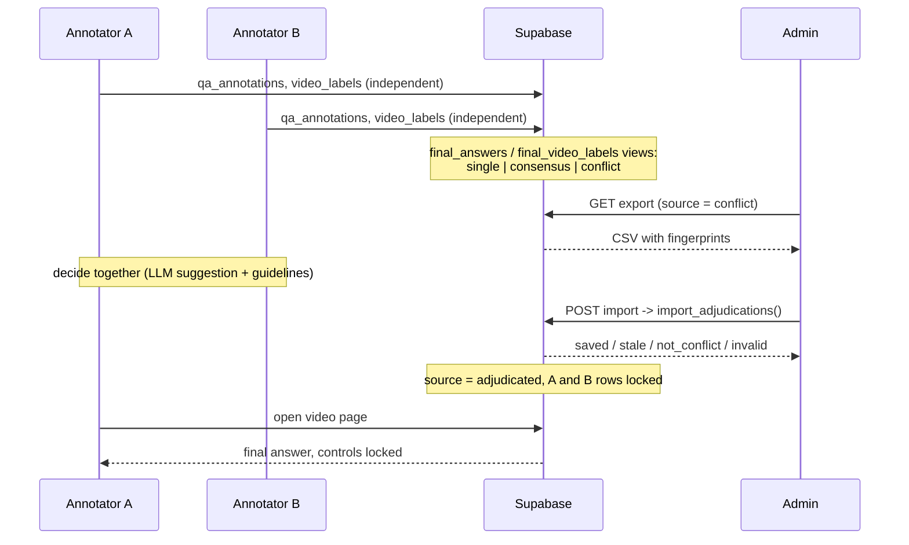
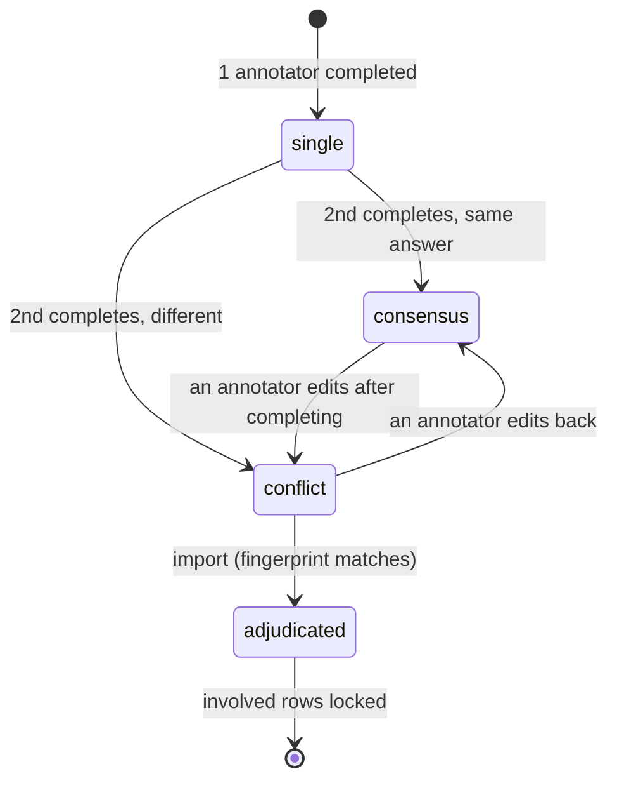

# Flow

```mermaid
sequenceDiagram
  participant A as Annotator A
  participant B as Annotator B
  participant DB as Supabase
  participant Ad as Admin
  A->>DB: qa_annotations, video_labels (independent)
  B->>DB: qa_annotations, video_labels (independent)
  Note over DB: final_answers / final_video_labels views:<br/>single | consensus | conflict
  Ad->>DB: GET export (source = conflict)
  DB-->>Ad: CSV with fingerprints
  Note over A,B: decide together (LLM suggestion + guidelines)
  Ad->>DB: POST import -> import_adjudications()
  DB-->>Ad: saved / stale / not_conflict / invalid
  Note over DB: source = adjudicated, A and B rows locked
  A->>DB: open video page
  DB-->>A: final answer, controls locked
```

```mermaid
stateDiagram-v2
  [*] --> single: 1 annotator completed
  single --> consensus: 2nd completes, same answer
  single --> conflict: 2nd completes, different
  conflict --> adjudicated: import (fingerprint matches)
  consensus --> conflict: an annotator edits after completing
  conflict --> consensus: an annotator edits back
  adjudicated --> [*]: involved rows locked
```
