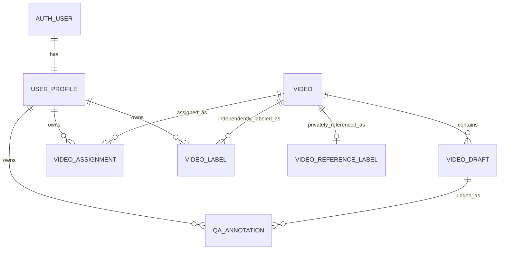

# Team video labeling platform

Status: deployed to Vercel on 2026-10-03.
The hosted scope is Labeling and administration only.
Queue, Review, the local Python pipeline, and local SQLite remain local.

## Workflow

An invited user logs in with Supabase Auth.
The server loads the enabled profile and routes admins to `/admin` and annotators to `/annotate`.
Both roles can view a video through the authenticated native HTML5 player.
The player supports play, pause, timeline seeking, Space, arrow-key steps, and configurable 0.25 or 0.20 second steps.
The old start and end segment form is absent from the hosted page.

A video becomes labelable only when it has exactly nine questions in the order S, E, N, C, V, O, R, Attr, Prev.
Each annotator claims a ready video and chooses one independent `difficulty` and `event_label` pair for the video.
Each question shows the uploaded or imported answer and accepts an AGREE, NOT_ANSWERABLE, or DISAGREE verdict.
DISAGREE requires a reason, and the `khác` reason also requires a note.
Each saved verdict requires one to three evidence frame positions within the video duration.
The annotator can edit the answer and revisit saved work.
An assignment can be completed only after the video label and all nine question verdicts exist.

## Administrator CSV contract

The admin selects a video in `/admin/videos` and uploads a UTF-8 CSV with this exact header:

```csv
video_id,qgroup,question,answer,difficulty,event_label
```

The file has nine rows for one video, one for each required `qgroup`.
`video_id` is the Supabase video UUID shown in `/admin/videos`, not the Google Drive file ID.
`question` and `answer` are required and can contain commas when CSV-quoted.
`difficulty` is empty or one of `easy`, `medium`, `high`.
`event_label` is empty or one of `accident`, `near-miss`.
The two reference labels must be supplied together and repeated identically in all nine rows when present.
The reference labels are visible only to admins and never prefill an annotator's independent ballot.
The UI provides a per-video CSV template with the nine current question prompts.
The database imports all nine rows in one transaction and rejects replacements after annotation has begun.

## Data and access



Google Drive stores the video bytes.
Supabase PostgreSQL stores users, metadata, nine drafts, independent labels, verdicts, evidence positions, and assignments.
The database enforces row level security, the user identity for writes, the evidence count and bounds, and completion requirements.
Admin Auth operations use a server-only secret after a live role check.
The admin can add, edit, disable, and permanently delete users.
Deleting a user cascades their assignments and labels, while disabling preserves them.

## Video sources

The original Drive clip was MPEG-4 Part 2 and could not reliably play in an HTML5 video element.
An H.264 copy was uploaded to the same Drive folder, and its database metadata now points to that copy.
The original file remains in Drive.
This clip has no VLM drafts and displays a waiting state until an admin uploads its nine answers.
Two local shot videos with verified SHA-256 matches to the local drafts were uploaded to Drive.
Their latest prompt version provides nine actual VLM drafts per video.
The older prompt version and four local SQLite verdicts remain local because their old free-form annotator IDs have not been mapped to Supabase Auth users.

## Verification and remaining external settings

Local and production checks exercised CSV upload, independent labels, nine verdicts, evidence validation, completion, role denial, admin deletion, authenticated Drive byte ranges, and both imported video pages.
Lint, TypeScript, and the Vercel Next.js build passed.
No browser surface was available for visual playback inspection, so a human browser playback check remains useful.
Supabase still reports public signup enabled.
Supabase Auth currently rejects a four-character password with a minimum of six, pending the user's Dashboard setting change to four.
The Drive folder currently permits anyone with the link to write, which should be changed to viewer if external writes are not intended.
